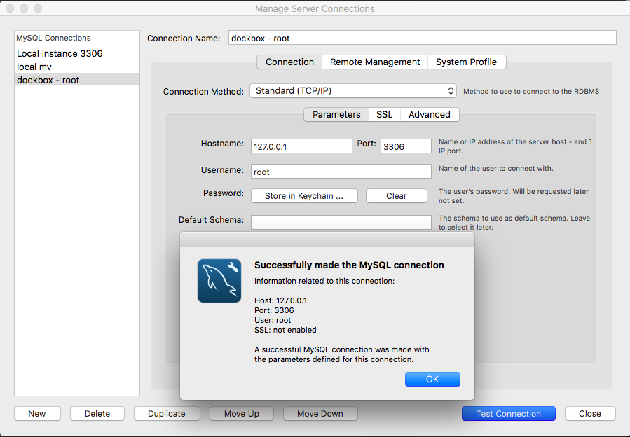
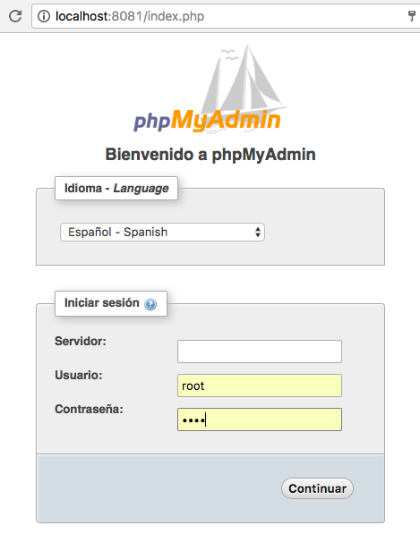

# MySql
Hay varias maneras de acceder a mysql y te lo explico en las siguientes lineas...

## A través del contenedor

Una vez que ya has inicializado el contenedor de `postgres` puedes acceder al contenedor con el siguiente comando

    docker-compose exec postgres bash

Dentro del contenedor debes cambiar al usuario `postgres` y luego ejecutar el psql
    
    root@7ee91da1f0a3:/  mysql -u root -proot
    
    Welcome to the MySQL monitor.  Commands end with ; or \g.
    Your MySQL connection id is 6
    Server version: 8.0.0-dmr MySQL Community Server (GPL)
    
    Copyright (c) 2000, 2016, Oracle and/or its affiliates. All rights reserved.
    
    Oracle is a registered trademark of Oracle Corporation and/or its
    affiliates. Other names may be trademarks of their respective
    owners.
    
    Type 'help;' or '\h' for help. Type '\c' to clear the current input statement.
    
    mysql

## Por medio de la consola

Conectarse a mysql desde consola con tu Ip

    mysql -h 127.0.0.1 -u root -p
    mysql -h 192.168.1.52 -u root -proot
    mysql -h 192.168.1.52 -u dev -p123456
    

## Bases de datos inicializadas

Si desea hacer una inicialización de nuevas bases de datos adicionales en el contenedor de mysql, agregue uno o más scripts **.sh** en el directorio `postgres/sql/` (creando el directorio si es necesario). Cuando ejecutes el comando 
    
    docker-compose down
    docker-compose build 
    
docker ejecutará cualquier script **.sh** que se encuentre en ese directorio para realizar una inicialización posterior antes de iniciar el servicio.

Por ejemplo, para agregar un usuario adicional y una base de datos, añada lo siguiente a en el directorio `mysql/sql/init-proyecto-db.sh`:

```
#!/bin/bash
set -e

mysql -u root -p"$MYSQL_ROOT_PASSWORD" << EOF
    DROP USER IF EXISTS user_demo;
    CREATE USER 'user_demo'@'%';
    CREATE DATABASE IF NOT EXISTS demo_inicial;
    GRANT ALL ON demo_inicial.* TO 'user_demo'@'%' IDENTIFIED BY '123456';
EOF
```

Estos archivos de inicialización se ejecutarán en orden de nombres ordenados según lo definido por la configuración regional actual, cuyo valor predeterminado es en_US.utf8. Cualquier archivo **.sh** será ejecutado por `root`, que por defecto es el superusuario root. Se recomienda que cualquier comando mysql que se ejecute dentro de una secuencia de comandos **.sh** se ejecute como root utilizando los parametro `-u root -p"$MYSQL_ROOT_PASSWORD"`. 

Puedes ver más configuración en la documentación oficial de Docker [MySql](https://hub.docker.com/_/mysql/)

Cuando vuelvas a levantar el contenedor podrás ver las bases de datos.

    docker-compose up -d mysql
    
**Info:** cada vez que ejecutas el comando `docker-compose build` los contenedores vuelven a su estado inicial borrando cualquier configuración extra y sus datos.
    
## Backup

Para realizar backup de todas las bases de datos:

**MySql**

    mkdir -p $(pwd)/data/mysql/backup && docker exec dockbox_mysql_1 sh -c 'exec mysqldump --all-databases -uroot -p"$MYSQL_ROOT_PASSWORD"' > $(pwd)/data/mysql/backup/all-databases.sql

**MariaDb**

    mkdir -p $(pwd)/data/mariadb/backup && docker exec dockbox_mariadb_1 sh -c 'exec mysqldump --all-databases -uroot -p"$MYSQL_ROOT_PASSWORD"' > $(pwd)/data/mariadb/backup/all-databases.sql

Ahora puedes encontrar un fichero llamado `all-databases.sql` en el directorio `dockbox/data/mysql/backup/` o `dockbox/data/mariadb/backup`.

## Otras configuraciones

Si necesitas añadir alguna configuración en mysql, no es necesario entrar al contenedor, puedes hacer cualquier ajustes que necesites en `my.cnf` en el directorio `mysql` , para que estos cambios apliquen debes ejecutar

    docker-compose down
    docker-compose build
    docker-compose up -d mysql

Configuración con frameworks
====
## Symfony 3

    database_host: 192.168.1.52 <-- tu ip address local
    database_port: 3306
    database_name: landing_viewer_dev
    database_user: root
    database_password: root
    
## Laravel 5

    DB_CONNECTION=mysql
    DB_HOST=mysql
    DB_DATABASE=demo
    DB_USERNAME=root
    DB_PASSWORD=root   
         
## Yii 2

    $config = [
        'class' => 'yii\db\Connection',
        'dsn' => 'mysql:host=127.0.0.1;dbname=demo',
        'username' => 'root',
        'password' => 'root',
        'charset' => 'utf8',
    ];  
 

## Utilizando un software

Puedes administrar tus bases de datos con tu software preferido.
Te recomiendo utilizar tu ipaddress como host.

**Workbench**<br>


**PHPMyAdmin**<br>
Antes de acceder a la ruta [http://localhost:8081](http://localhost:8081) asegurate de haber levantado el contenedor de phpmyadmin, o levantarlo ejecutando:

    docker-compose up -d phpmyadmin

El campo `servidor` dejar en blanco.

