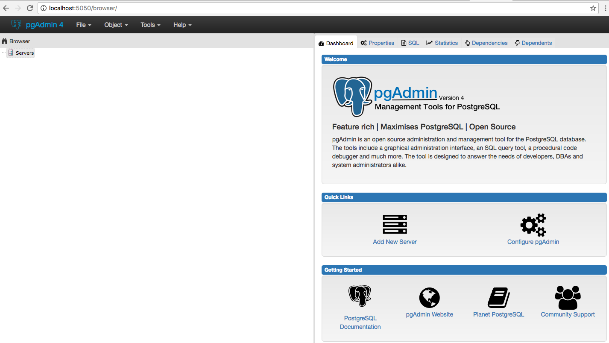

# PostgreSql

Hay varias maneras de acceder a postgres y te lo explico en las siguientes lineas...

## A través del contenedor

Una vez que ya has inicializado el contenedor de `postgres` puedes acceder al contenedor con el siguiente comando

    docker-compose exec postgres bash

Dentro del contenedor debes cambiar al usuario `postgres` y luego ejecutar el psql
    
    root@26db16090640:/# su postgres
    $ psql
    
    psql (9.6.2)
    Type "help" for help.
    
    postgres=# 

## Por medio de la consola

Conectarse a postgres desde consola con tu Ip

    psql -h 127.0.0.1 -U dev -W demo
    psql -h 192.168.1.52 -U dev -W demo
    
**Nota:** para crear nuevas bases de datos te recomiendo entrar a traves del contenedor...

## Bases de datos inicializadas

Si desea hacer una inicialización de nuevas bases de datos adicionales en el contenedor de postgres, agregue uno o más scripts **.sh** en el directorio `postgres/sql/` (creando el directorio si es necesario). Cuando ejecutes el comando 
    
    docker-compose down
    docker-compose build 
    
docker ejecutará cualquier script **.sh** que se encuentre en ese directorio para realizar una inicialización posterior antes de iniciar el servicio.

Por ejemplo, para agregar un usuario adicional y una base de datos, añada lo siguiente a en el directorio `postgres/sql/init-proyecto-db.sh`:

```
#!/bin/bash
set -e

psql -v ON_ERROR_STOP=1 --username "$POSTGRES_USER" <<-EOSQL
    CREATE USER user1;
    CREATE DATABASE aplicacion1;
    GRANT ALL PRIVILEGES ON DATABASE aplicacion1 TO user1;
EOSQL
```

Estos archivos de inicialización se ejecutarán en orden de nombres ordenados según lo definido por la configuración regional actual, cuyo valor predeterminado es en_US.utf8. Cualquier archivo **.sh** será ejecutado por POSTGRES_USER, que por defecto es el superusuario postgres. Se recomienda que cualquier comando psql que se ejecute dentro de una secuencia de comandos **.sh** se ejecute como POSTGRES_USER utilizando el parametro `--username "$POSTGRES_USER"`. Este usuario podrá conectarse sin una contraseña debido a la presencia de autenticación de confianza para conexiones de socket Unix hechas dentro del contenedor.

Puedes ver más configuración en la documentación oficial de Docker [Postgres](https://hub.docker.com/_/postgres/)

Cuando vuelvas a levantar el contenedor podrás ver las bases de datos.

    docker-compose up -d postgres
    
**Info:** cada vez que ejecutas el comando `docker-compose build` los contenedores vuelven a su estado inicial borrando cualquier configuración extra y sus datos.

## Backup

Para realizar backup de todas las bases de datos:

    docker exec dockbox_postgres_1 sh -c 'PGPASSWORD="$POSTGRES_PASSWORD" exec pg_dumpall -h "$POSTGRES_PORT_5432_TCP_ADDR" -p "$POSTGRES_PORT_5432_TCP_PORT" -U postgres >> /var/lib/postgresql/backup/all-databases.sql'

Ahora puedes encontrar un fichero llamado `all-databases.sql` en el directorio `dockbox/data/postgres/backup/`.

Puedes ver otras formas de realizar backups en la documentación de [PostgresSql Tutorial](http://www.postgresqltutorial.com/postgresql-backup-database/)

## Otras configuraciones

Si necesitas cambiar, añadir o eliminar alguna configuración en postgrest, no es necesario entrar al contenedor, tienes todos los ficheros de la librería de postgresql en `data/postgres/data` y puedes hacer cualquier ajustes que necesites, para que estos cambios apliquen debes ejecutar

    docker-compose down
    docker-compose up -d postgres

Configuración con frameworks
====
## Symfony 3

    database_host: 192.168.1.52 <-- tu ip address local
    database_port: 5432
    database_name: landing_viewer_dev
    database_user: dev
    database_password: 123456
    
## Laravel 5

    DB_CONNECTION=postgres
    DB_HOST=postgres
    DB_DATABASE=demo
    DB_USERNAME=dev
    DB_PASSWORD=123456   
         
## Yii 2

    $config = [
        'class' => 'yii\db\Connection',
        'dsn' => 'mysql:host=192.168.1.52;dbname=demo;port=5432;',
        'username' => 'dev',
        'password' => '123456',
        'charset' => 'utf8',
    ];  
     
     
## Utilizando un software

Puedes administrar tus bases de datos con tu software preferido.
Te recomiendo utilizar tu ipaddress como host.

**PG Commander**<br>


**PG Admin**<br>
