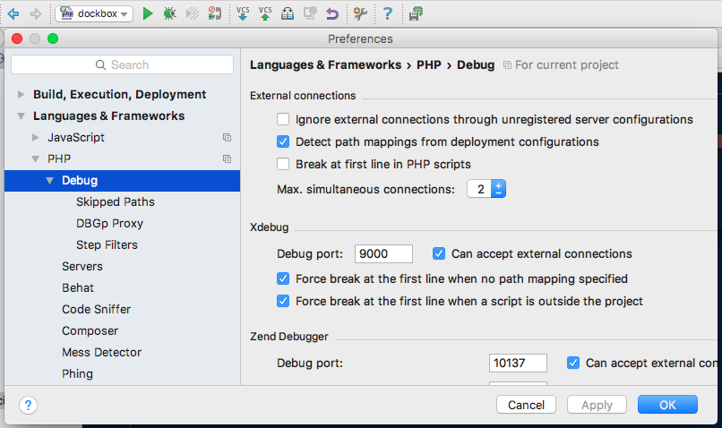
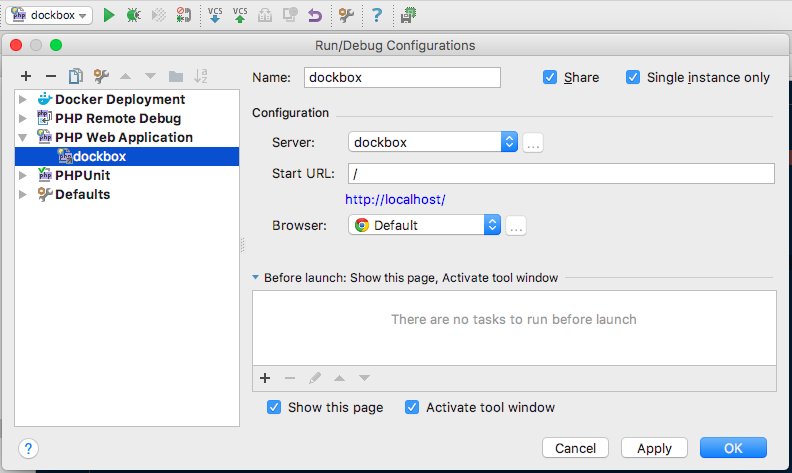
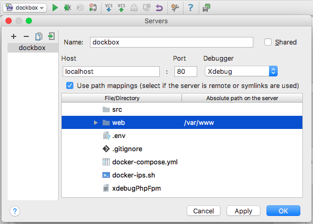
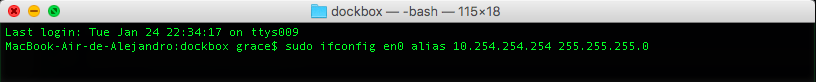

## XDebug

Esta configuración la puedes cambiar antes de hacer el docker-compose build en el archivo que se encuentra en en la carpeta php `php/xdbug.ini`  
A continación te indico como configurar tu PhpStorm paso a paso, tener en cuenta cambiar tu ipaddress por la que muestro en las imagenes `10.254.254.254`

**Paso 1** 

**Paso 2** 

**Paso 3** 

**Paso 4** 

**Paso 5 (Opcional)** 
Este paso sólo si usas un Mac. 
Crear alias para el host remoto y localhost

    sudo ifconfig en0 alias 10.254.254.254 255.255.255.0

**Paso 6** 

    
### Gestionar nuestro servicio de xdebug

Iniciar, Detener o Ver estado de xdebug

    cd /directorio/dockbox

    sh xdebugPhp start
    sh xdebugPhp stop
    sh xdebugPhp status
